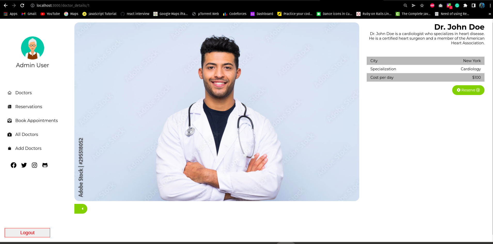
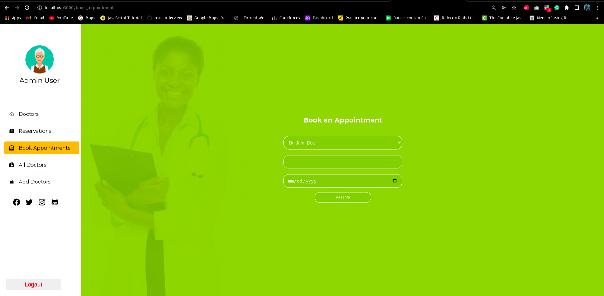

# Book Appointments Frontend

> Book Appointments frontend is react frontend application for doctor book appointments. This applications is responsive and users can load, create, and delete doctors and reservations. Users need to sign up or sign in to access application. They can sign up or sign in using the sign up and login forms.

## Link to the backend

[Book A Doctor Backend](https://github.com/clintonjosephs/book-a-doctor-frontend)

## Kanban Board
[Kanban Board](https://github.com/clintonjosephs/book-a-doctor-backend/projects/1)

> ***We are a group of five***
1. Team 1 - [Clinton](https://github.com/clintonjosephs)
2. Team 2 - [Jihane](https://github.com/jaflih)
3. Team 3 - [Nuri](https://github.com/Nuri1977)
4. Team 4 - [Mithi](https://github.com/Mithi-code)
5. Team 5 - [Atilla](https://github.com/AtillaTahak)

## Preview:

### Home Page


### Details Page



### Book Appoinments Page



### Reservations Page


## Built With

- HTML
- CSS
- JavaScript
- REACT
- Redux
- Webpack
- Jest

## Live version

[In progress]

## Getting Started

To get a local copy up and running follow these simple example steps.

### Prerequisites
- A text editor(preferably Visual Studio Code)
- Node
- Web browser

### Install
- [Git](https://git-scm.com/downloads)
- [Node](https://nodejs.org/en/download/)

### Using it Locally

- Clone the project

```bash 
git clone git@github.com:clintonjosephs/book-a-doctor-frontend.git

cd book-a-doctor-frontend
```

- Install dependencies

```bash
npm i 
or
npm install
```
- To Start the development server
```bash
npm start
```

- To test the project
```bash
npm run test
```


## Backend Repo

[Book Doctors Backend](https://github.com/clintonjosephs/book-a-doctor-backend.git)


## Team Members

👤 **CLINTON MBONU**

- GitHub: [@clintonjosephs](https://github.com/clintonjosephs)
- Twitter: [@clintonmbonu2](https://twitter.com/clintonmbonu2)
- LinkedIn: [@clinton-mbonu](https://www.linkedin.com/in/clinton-mbonu/)

👤 **MITHLESH KUMAR**

- GitHub: [@Mithi-code](https://github.com/Mithi-code)
- LinkedIn: [@mithicode](https://www.linkedin.com/in/mithicode/)
- Twitter: [@LazyMithlesh](https://twitter.com/LazyMithlesh)

👤 **Jihane Aflih**

- GitHub: [@jaflih](https://github.com/jaflih)
- Twitter: []()
- LinkedIn: []()

👤 **NURI LACKA**

- GitHub: [@Nuri1977](https://github.com/Nuri1977)
- LinkedIn: [@Nuri](https://www.linkedin.com/in/nuri-lacka-7141b01ba/)
- Twitter: [@LackaNuri](https://twitter.com/LackaNuri)

👤 **ATILLA**

- Github : [@AtillaTahak](https://github.com/AtillaTahak)
- Twitter : [@AtillaTahaa](https://twitter.com/AtillaTahaa)
- LinkedIn: [@Ailla](https://www.linkedin.com/in/atilla-taha-k%C3%B6rd%C3%BC%C4%9F%C3%BCm-a93702186/)

## 🤝 Contributing

Contributions, issues, and feature requests are welcome!

Feel free to check the [issues page](https://github.com/clintonjosephs/book-a-doctor-frontend/issues).

## Show your support

Give a ⭐️ if you like this project!

## Acknowledgments

- Inspired by original design for Creative Commons by [Murat Korkmaz](https://www.behance.net/muratk) on [Behance](https://www.behance.net/gallery/26425031/Vespa-Responsive-Redesign).
- Inspiration: Microverse

## 📝 License

This project is [MIT](./LICENSE.md) licensed.
